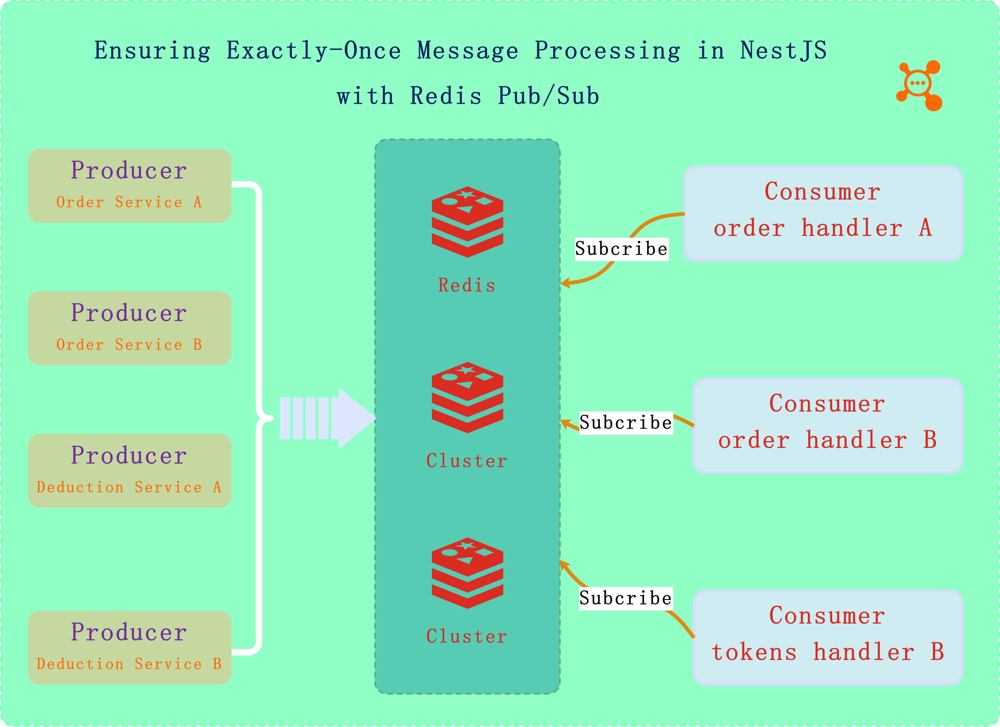

<h1 align="center">@Tsailab/ioredis-mq</h1>
<p align="center" >
  <a href="https://github.com/lotolab" target="blank">
    
  </a>
</p>

<p align="center">
  <a href="https://www.npmjs.com/~tsailab" target="_blank"></a>
  <a href="https://discord.gg/lotolab" target="_blank"></a>
  <a href="https://x.com/lamborghini171" target="_blank"></a>  
  <a href="https://www.npmjs.com/~tsailab" target="_blank"></a>
  <a href="https://www.npmjs.com/~tsailab" target="_blank"></a>
</p>

## Description

In the world of distributed systems, ensuring that a message is processed exactly once can be a significant challenge.

The @tsailab/ioredis-mq make sure exactly-once message processing using Redis Pub/Sub with distributed locks in a NestJS application, running on Kubernetes, and deployed using Helm. This solution ensures that multiple instances of a service receive the same message, but only one instance processes it, avoiding duplicate processing.



## Installation
```
$ npm install -g @tsailab/ioredis-mq
```


## Usage

> IORedisMQModule providers : RedisService ,RedisMQService and yamlConfigLoader

- RedisService: a ioredis client wrapper
- RedisMQService: a ioredis pub/sub client wrapper
- yamlConfigLoader : a environment yaml configuration files loader tool

### Configuration forRoot

```ts
@Module(
  imports:[
    IORedisMqModule.forRoot({
      type: 'single',// single
      redisOptions: {
        host: '172.20.0.1',
        port: 6379,
        db: 0,
        password: 'RDS123',
      },
    }),
    ... // others
  ]
)
export class ProducerAppModule{}
```

### Configuration forRoot

```ts
import {
  IORedisModuleAsyncOptions,
  IORedisMQModule,
  yamlConfigLoader,
} from '@tsailab/ioredis-mq'
@Module({
  imports: [
    ConfigModule.forRoot({
      isGlobal: true,
      load: [yamlConfigLoader],
    }),
    IORedisMQModule.forRootAsync(
      {
        useFactory(config: ConfigService) {
          // load form your app environments .conf/<stage>/*.yaml files
          // stage: dev,prod,test,stage 
          const cfg = config.get('ioredis');
          return cfg 
        },
        inject: [ConfigService],
      } as IORedisModuleAsyncOptions,
      true,
    ),
  ],
})

```


:boom: :boom: :boom: :star2: :star2: :two_hearts: :two_hearts: :two_hearts:

<h4 align="left">
Congratulations, you have use RedisService or RedisMQService in your modules.
</h4>

:star: :star: :star: :star: :star: :star: :star: :star:


Learn more usages in the source [ioredis-mq docs](https://github.com/tsai-plat/ioredis-mq/docs)
 
------

## Stay in touch

- Twitter - [@lamborghini171](https://twitter.com/lamborghini171)

:revolving_hearts::revolving_hearts::revolving_hearts: :raising_hand: :raising_hand: :raising_hand: :raising_hand: :raising_hand: :raising_hand: :raising_hand: :raising_hand: :raising_hand: :raising_hand: :raising_hand: :raising_hand::raising_hand::raising_hand::revolving_hearts::revolving_hearts::revolving_hearts:

<font color="#ff8f00"><h3>Sincerely invite experts to improve the project functions together !</h3></font>

:revolving_hearts::revolving_hearts::revolving_hearts: :raising_hand: :raising_hand: :raising_hand: :raising_hand: :raising_hand: :raising_hand: :raising_hand: :raising_hand: :raising_hand: :raising_hand: :raising_hand: :raising_hand::raising_hand::raising_hand::revolving_hearts: :revolving_hearts::revolving_hearts:

## License

The @Tsailab/ioredis-mq packages is [MIT licensed](LICENSE).

> Give me a cup of coffee? Thanks much.

<div align="center">
  <div>
    
    <span>Wechat</span>
  </div>
  <span>OR</span>
    <div>
    
    <span>Wechat</span>
  </div>
</div>
