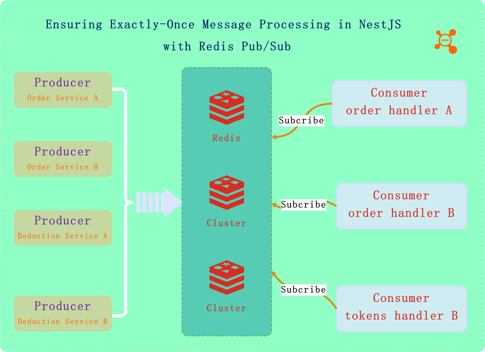
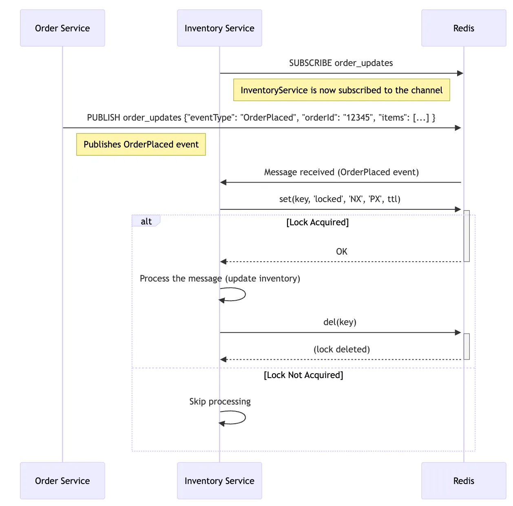

# About Tsailab IORedis-MQ

In the world of distributed systems, ensuring that a message is processed exactly once can be a significant challenge.

The @tsailab/ioredis-mq make sure exactly-once message processing using Redis Pub/Sub with distributed locks in a NestJS application, running on Kubernetes, and deployed using Helm. This solution ensures that multiple instances of a service receive the same message, but only one instance processes it, avoiding duplicate processing.

## Solution



### 



---------
## Usage 


## Configuration

### 

```ts
// some module imports forRootAsync
imports: [
    IORedisMqModule.forRoot(
        {
            type: 'single',// single
            redisOptions: {
              host: '172.20.0.1',
              port: 6379,
              db: 7,
              password: 'RDS123',
            },
        },
    ),
    IORedisMqModule.forRootAsync(
      {
        useFactory() {
          return {
            redisOptions: {
              host: '172.20.0.1',
              port: 6379,
              db: 7,
              password: 'RDS123',
            },
          };
        },
        inject: [ConfigService],
      } as IoRedisModuleAsyncOptions,
      true,
    ),
],

```

> Configuration Options load by YamlLoader 

```yaml

ioredis:
  type: single
  closeClient: true
  readyLog: true
  errorLog: true
  redisOptions: 
    url:
    path:
    host: 127.0.0.1
    port: 6379
    db: 7
    password: password

# cluster 
    nodes:
      - host: 127.0.0.1
        port: 6973
      - host: 101.1.24.58
        port: 6973
 
# channels default comm  
  channels:
    - sys-log
    - chatbot
  mqOptions:
    verbose: true,
    micro: false
    ttl: 200  
```

