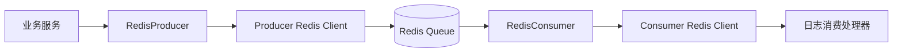

# RedisLogMQ 架构设计方案

## 1. 目标

基于 Redis List 的 RPush / BLPop 实现日志生产者与消费者解耦，满足以下要求：

- 生产侧提供独立的 Redis 写能力，负责入队（RPush / LPush）和队列长度查询。
- 消费侧提供独立的 Redis 读能力，负责出队（BLPop / BRPop）和队列状态查看。
- 生产者和消费者使用独立的 Redis 客户端实例，避免共享连接状态和事件处理影响。
- 配置与业务配置解耦，并支持 Nest 的异步注入方式。
- 保持与当前项目已有的 Nest Module / Provider / Service 封装风格一致。

---

## 2. 设计原则

1. 业务解耦

   - 日志生产与消费职责拆分为两个服务，分别暴露自己的接口。

2. 连接隔离

   - 生产端和消费端使用两个独立的 Redis client 实例，做到连接池与事件循环层面的隔离。
   - 在 Node.js 场景下，真正的“线程隔离”并非 OS 线程级别，而是“客户端实例、连接对象和事件处理链路”的隔离；如果需要更强隔离，可把生产者/消费者部署为独立进程或独立 Worker。

3. 配置解耦

   - Redis 配置与业务服务配置分离，避免业务模块直接耦合到底层地址、端口、数据库等信息。

4. 与现有封装风格一致
   - 继续使用 DynamicModule + Provider + Service 的方式，避免引入新的使用模式。

---

## 3. 总体架构

整体上可以分为三层：

- 基础层：负责创建 Redis 客户端、统一配置校验、提供通用 token。
- 业务层：负责封装生产和消费能力。
- 应用层：由业务服务通过注入服务完成队列生产和消费处理。



---

## 4. 模块设计

### 4.1 IORedisMQModule

新增一个专门承载日志队列能力的模块，命名为 `IORedisMQModule`，提供如下注册方式：

```typescript
@Module({
  imports: [
    IORedisMQModule.forMQRootAsync({
      useFactory() {
        return {
          producer: {
            redisOptions: {
              host: '127.0.0.1',
              port: 6379,
              db: 1,
            },
          },
          consumer: {
            redisOptions: {
              host: '127.0.0.1',
              port: 6379,
              db: 2,
            },
          },
          queue: {
            prefix: 'redislog:',
          },
        };
      },
    }),
  ],
})
export class AppModule {}
```

该模块职责如下：

- 负责注册生产和消费两个 Redis 客户端 provider。
- 负责注册 `RedisProducer` 和 `RedisConsumer`。
- 负责导出对应的服务，供业务模块注入。

### 4.2 生产侧服务

新增 `RedisProducer`，提供以下能力：

- `rpush(key, value)`：从右侧入队。
- `lpush(key, value)`：从左侧入队。
- `llen(key)`：查询队列长度。
- `lrange(key, start, stop)`：读取队列内容。
- `trim(key, start, stop)`：裁剪队列。
- `ping()`：检测连通性。

建议将其封装为一个独立 service，避免和普通缓存服务混用。

### 4.3 消费侧服务

新增 `RedisConsumer`，提供以下能力：

- `blpop(key, timeout)`：阻塞式从左侧出队。
- `brpop(key, timeout)`：阻塞式从右侧出队。
- `llen(key)`：查询当前队列长度。
- `lrange(key, start, stop)`：查看队列内容。
- `ping()`：检测连通性。

该服务适合用于后台消费者任务、日志消费线程或异步 worker。

### 4.4 可选消费循环服务

为了方便业务接入，可以再增加一个轻量封装层：

- `RedisLogConsumerRunner`
  - 监听队列消息。
  - 通过 `blpop` 轮询消费。
  - 将消息分发给业务 handler。

该层不一定要和业务强绑定，可以作为可选能力，避免让基础模块变得过重。

---

## 5. 配置结构设计

建议把配置拆成三个部分：

```typescript
export interface RedisLogMQProducerOptions {
  redisOptions: SingleRedisOptions | ClusterRedisOptions;
  clientOptions?: ClientExtraOptions;
}

export interface RedisLogMQConsumerOptions {
  redisOptions: SingleRedisOptions | ClusterRedisOptions;
  clientOptions?: ClientExtraOptions;
}

export interface RedisLogMQQueueOptions {
  prefix?: string;
  maxLen?: number;
  blockTimeout?: number;
}

export interface RedisLogMQModuleOptions {
  producer: RedisLogMQProducerOptions;
  consumer: RedisLogMQConsumerOptions;
  queue?: RedisLogMQQueueOptions;
}
```

### 5.1 配置特点

- `producer` 和 `consumer` 分别独立配置，便于后续扩展到不同实例、不同数据库或不同 Redis 集群。
- `queue` 配置负责统一队列命名和消费行为，避免业务代码在每处手写 key。
- 业务模块只需要注入服务，不需要知道底层连接细节。

---

## 6. Provider / Token 设计

为了保持与现有项目风格一致，建议引入两个独立 token：

- `IOREDIS_PRODUCER_CLIENT`
- `IOREDIS_CONSUMER_CLIENT`

对应的 provider 结构如下：

```typescript
{
  provide: IOREDIS_PRODUCER_CLIENT,
  useFactory: (options) => createRedisClient(options.producer.redisOptions),
  inject: [IOREDIS_MOULE_OPTIONS_TOKEN],
}
```

```typescript
{
  provide: IOREDIS_CONSUMER_CLIENT,
  useFactory: (options) => createRedisClient(options.consumer.redisOptions),
  inject: [IOREDIS_MOULE_OPTIONS_TOKEN],
}
```

这样可以让：

- `RedisProducer` 注入生产端 client。
- `RedisConsumer` 注入消费端 client。
- 业务代码只依赖 service，而不是直接依赖底层 ioredis 对象。

---

## 7. 与当前项目的融合方式

当前项目已经具备以下基础能力：

- `IORedisCoreModule`：负责基础模块注册。
- `RedisService`：负责通用缓存能力。
- `RedisMQService`：负责发布订阅形式的 MQ 能力。

因此，新的 RedisLogMQ 方案建议采用“在现有基础模块上增加一层业务模块”的方式，而不是直接破坏原有结构：

1. 保留现有 `IORedisCoreModule` 作为底层连接与 provider 基础设施。
2. 新增 `IORedisMQModule` 作为日志队列场景的聚合模块。
3. 在 `IORedisMQModule` 中注册：
   - `RedisProducer`
   - `RedisConsumer`
   - 两个独立 Redis client provider
4. 业务服务通过注入 `RedisProducer` / `RedisConsumer` 使用能力。

这能兼顾现有模块能力和后续扩展能力。

---

## 8. 实现落地建议

建议按以下步骤实现：

1. 增加两个新的服务文件：

   - `lib/services/redis.producer.ts`
   - `lib/services/redis.consumer.ts`

2. 增加两个新的 provider helper：

   - `create.redis.producer.helper.ts`
   - `create.redis.consumer.helper.ts`

3. 扩展 `lib/interfaces/core.interface.ts`，定义生产/消费/队列相关配置接口。

4. 在 `lib/ioredis.mq.module.ts` 中新增 `forMQRoot` / `forMQRootAsync` 注册方法。

5. 在 `lib/index.ts` 中导出新的服务和模块。

6. 增加 sample 示例，演示：
   - 生产者入队日志。
   - 消费者阻塞消费日志。
   - 错误处理与重试策略。

---

## 9. 结论

本方案的核心是：

- 用两个独立的 Redis client 实例分别承载生产和消费能力；
- 用 Nest 的 DynamicModule 和 Provider 机制完成模块注册；
- 通过 `RedisProducer` 和 `RedisConsumer` 将底层 Redis 操作封装成清晰的业务接口；
- 保留与当前项目已有封装风格一致的扩展方式，便于后续维护和演进。

从工程角度看，这是一种兼顾“清晰分层、可扩展、易测试、易接入”的实现方案，适合当前项目继续演进为真正的 RedisLogMQ 能力模块。
